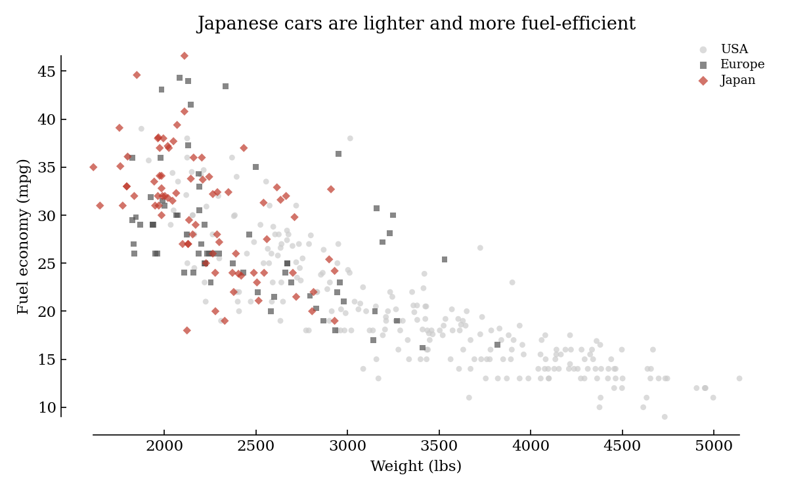
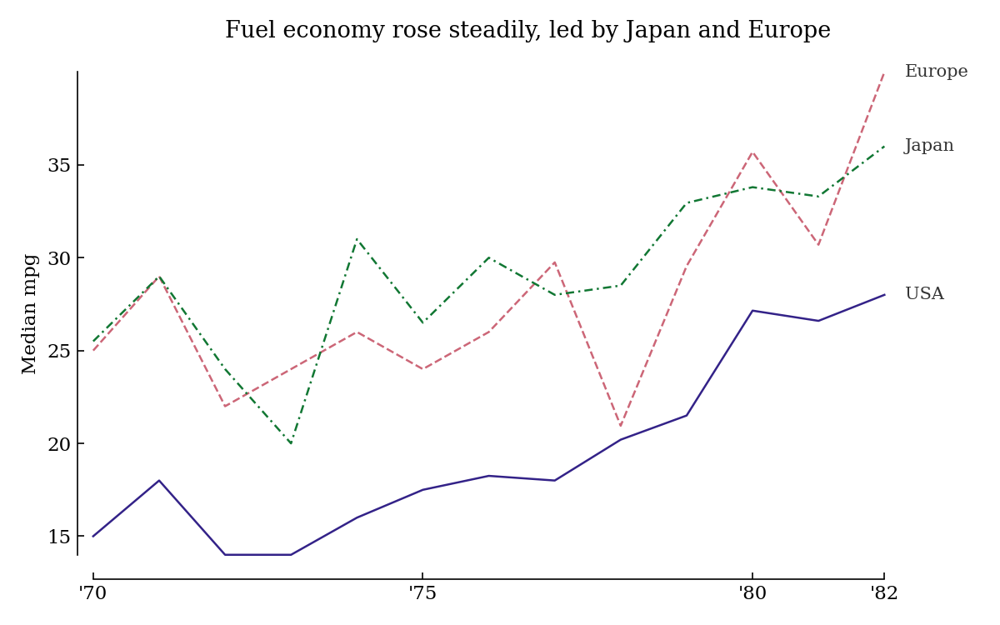
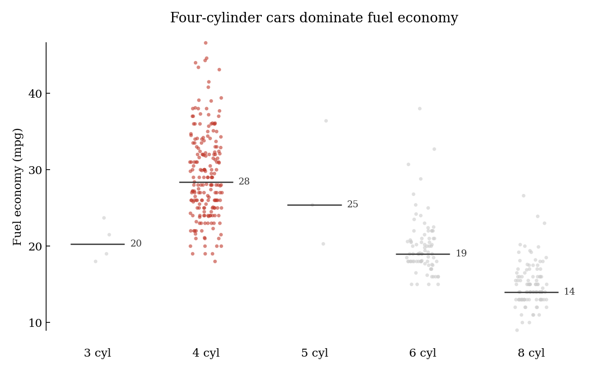
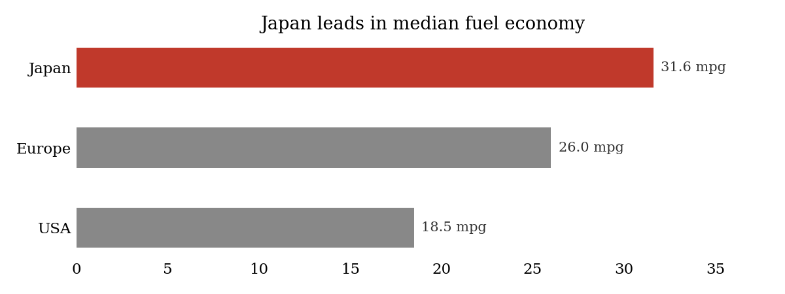
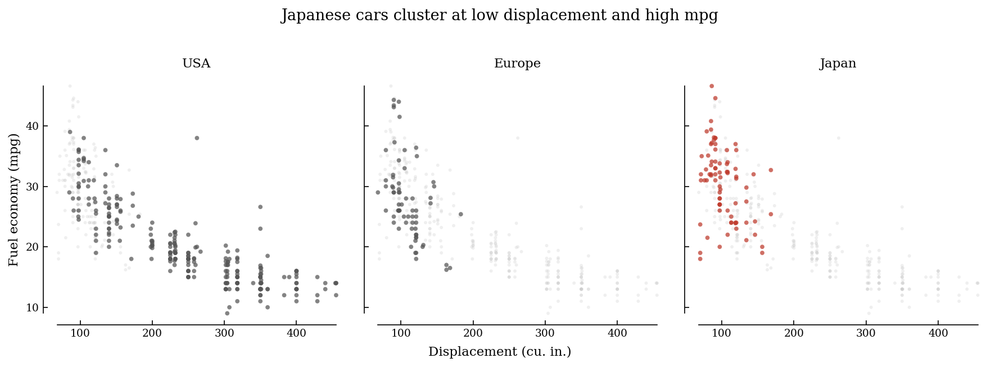

# clean-viz-skill

<div align="center">
<pre>
mpg
45 |                            Japan
35 |                   Europe
25 |          USA
15 +------------------------------- year
     '70       '75       '80   '82
</pre>
</div>

<p align="center">
  <a href="LICENSE"></a>
  
  
  
</p>

<p align="center"><strong>A reusable chart-quality skill for Codex, Claude Code, and Gemini CLI that removes chartjunk, rejects misleading chart forms, and forces an honest audit summary before the agent finishes.</strong></p>

For Codex, Claude Code, and Gemini CLI:

```bash
curl -fsSL https://raw.githubusercontent.com/maksymsherman/clean-viz-skill/main/install.sh | bash
```

> This project is not affiliated with Edward Tufte. It applies visualization principles described in his published works.

---

## TL;DR

**The Problem:** AI-generated charts usually ship with default library styling, weak labeling, decorative clutter, and chart choices that distort the data.

**The Solution:** `clean-viz` is an installable skill for Codex, Claude Code, and Gemini CLI that activates on chart-generation, critique, and restyling requests; enforces a strict visualization house style; substitutes banned chart types with more honest alternatives; and requires a compact audit summary covering code checks, rendered checks, and session consistency.

### Why use clean-viz?

| Need | What clean-viz does | Concrete artifact |
|---|---|---|
| **Cleaner defaults** | Uses range frames, inward ticks, serif typography, direct labels, and restrained color | [`skills/clean-viz/SKILL.md`](skills/clean-viz/SKILL.md) |
| **Safer chart choices** | Rejects pie, donut, radar, 3D, and dual-axis charts unless the user explicitly insists | [`skills/clean-viz/SKILL.md`](skills/clean-viz/SKILL.md) |
| **Honest verification** | Separates code review from actual visual verification so the agent cannot fake QA | [`checklist.md`](skills/clean-viz/references/checklist.md) |
| **Practical code patterns** | Ships runnable patterns for matplotlib, seaborn, Plotly, Altair, D3.js, ggplot2, and Observable Plot | [`references/`](skills/clean-viz/references/) |
| **Repo-side regression checks** | Includes a response checker and reference-example renderer for maintaining the skill itself | [`eval/`](eval/) |

---

## Quick Example

1. Install the skill:

```bash
curl -fsSL https://raw.githubusercontent.com/maksymsherman/clean-viz-skill/main/install.sh | bash
```

2. Restart Codex, Claude Code, or Gemini CLI if they were already running.

3. Ask for a chart:

```text
Create a matplotlib line chart showing monthly revenue in USD.
Use direct labels, range frames, inward ticks, and include an audit summary.
```

4. Ask for a critique pass:

```text
Critique this Plotly chart and restyle it to match the clean-viz rules.
Call out anything you could not visually verify.
```

5. Ask for a banned chart type:

```text
Make this market-share view as a pie chart.
```

The skill explains why pie charts are banned, proposes a horizontal bar chart or dot plot instead, and only complies if the user explicitly insists after seeing the alternative.

---

## Design Philosophy

### 1. Remove non-data ink first

The default posture is subtraction: fewer borders, fewer gridlines, fewer legends, fewer decorative colors.

### 2. Label marks directly whenever possible

Readers should not have to bounce between the plot and a legend box to understand the chart.

### 3. Prefer honest substitutes over blind compliance

If the requested form is misleading, the skill explains the problem and offers a better chart instead of quietly generating bad work.

### 4. Report what was actually checked

If a chart was not rendered, the skill must say so. The audit summary is part of the product, not a decorative footer.

### 5. Go deep where generated code actually lands

Matplotlib, seaborn, and Plotly have the deepest guidance because that is where most AI-generated chart code ends up.

---

## Comparison

| Approach | What you get | Tradeoff |
|---|---|---|
| **Default prompting** | Fast, but generic styling and inconsistent chart judgment | You repeat the same cleanup instructions every session |
| **A personal prompt snippet** | Better than raw defaults and easy to paste | No shared references, no install surface, and no maintenance harness |
| **`clean-viz-skill`** | Installable skill, banned-chart substitution, reference patterns, and audit discipline | Intentionally opinionated and not suited to every visual style |

**Best fit:**

- Analysis notebooks, reports, and dashboards where clarity matters more than decorative branding
- Teams that want a reusable chart standard instead of a pile of copied prompt fragments
- Workflows where you want the agent to explicitly separate code checks from visual checks

**Not a good fit:**

- Brand-heavy marketing graphics
- Editorial illustrations where aesthetics matter more than quantitative clarity

---

## Gallery

Five sample charts from the MPG dataset, all following the clean-viz rules:

| Chart | What it demonstrates |
|---|---|
|  | Grouped scatter with restrained color, range frames, and minimal legend usage |
|  | Multi-line chart with line-style variation, direct labels, and collision handling |
|  | Raw-data-first categorical view instead of a summary-only bar chart |
|  | Horizontal bar chart with direct value labels and a single narrative accent |
|  | Small multiples with shared axes and restrained annotation |

Render them locally:

```bash
uv run --with matplotlib --with numpy --with pandas python examples/mpg_five_charts.py
```

---

## Installation

### Installation at a glance

| Method | Best for | Entry point |
|---|---|---|
| **Universal installer script** | Fastest setup across all three agents | `curl -fsSL .../install.sh | bash` |
| **Manual clone** | Editing the repo, examples, or eval harness | `git clone ...` |
| **Single custom destination** | Install into one non-standard skills root | `...install.sh | bash -s -- --dest /custom/skills` |

### 1. Universal one-line install

This is the new primary install path:

```bash
curl -fsSL https://raw.githubusercontent.com/maksymsherman/clean-viz-skill/main/install.sh | bash
```

By default, the installer copies the same skill payload into all three standard skill roots:

```text
~/.codex/skills/clean-viz
~/.claude/skills/clean-viz
~/.gemini/skills/clean-viz
```

What it does:

- downloads the repo tarball from GitHub
- extracts only [`skills/clean-viz/`](skills/clean-viz/)
- installs that payload into all three agent skill directories by default
- falls back across `curl`, `wget`, or `python3` for downloads
- requires `tar` for archive extraction

Useful examples:

```bash
# replace an existing install
curl -fsSL https://raw.githubusercontent.com/maksymsherman/clean-viz-skill/main/install.sh | bash -s -- --force

# install only for Codex and Claude Code
curl -fsSL https://raw.githubusercontent.com/maksymsherman/clean-viz-skill/main/install.sh | bash -s -- --targets codex,claude

# install only into a custom skills directory
curl -fsSL https://raw.githubusercontent.com/maksymsherman/clean-viz-skill/main/install.sh | bash -s -- --dest /custom/skills

# install from a different git ref
curl -fsSL https://raw.githubusercontent.com/maksymsherman/clean-viz-skill/main/install.sh | bash -s -- --ref main
```

### 2. Manual install or development clone

If you want the repo extras as well:

```bash
git clone https://github.com/maksymsherman/clean-viz-skill.git
cp -R clean-viz-skill/skills/clean-viz "${CODEX_HOME:-$HOME/.codex}/skills/clean-viz"
cp -R clean-viz-skill/skills/clean-viz "${CLAUDE_HOME:-$HOME/.claude}/skills/clean-viz"
cp -R clean-viz-skill/skills/clean-viz "${GEMINI_HOME:-$HOME/.gemini}/skills/clean-viz"
```

If you prefer a built-in GitHub installer for Codex:

```bash
python3 ~/.codex/skills/.system/skill-installer/scripts/install-skill-from-github.py \
  --repo maksymsherman/clean-viz-skill \
  --path skills/clean-viz
```

Restart Codex, Claude Code, or Gemini CLI after installation so the new skill is picked up.

---

## What Gets Installed

The installer intentionally installs only the runtime skill payload, not the whole repository.

| Installed into Codex, Claude Code, and Gemini CLI | Repo-only extras |
|---|---|
| [`skills/clean-viz/SKILL.md`](skills/clean-viz/SKILL.md) | [`examples/`](examples/) |
| [`skills/clean-viz/agents/openai.yaml`](skills/clean-viz/agents/openai.yaml) | [`eval/`](eval/) |
| [`skills/clean-viz/references/`](skills/clean-viz/references/) | [`.claude-plugin/`](.claude-plugin/) |

That split is intentional:

- Codex, Claude Code, and Gemini CLI all need only the skill payload.
- The repository still includes [`.claude-plugin/`](.claude-plugin/) metadata, but the universal installer works through the shared `skills` model.
- Examples and eval tools stay repo-side because they are for development and maintenance, not runtime skill activation.

---

## Quick Start

1. Install `clean-viz` using one of the methods above.
2. Restart the tool if it was already running.
3. Use a concrete visualization request such as `create a line chart`, `restyle this Plotly figure`, or `critique this scatter plot`.
4. Name the target library when you care about the output surface, for example `matplotlib` or `Plotly`.
5. Review the audit summary at the end of the response.
6. If you want to customize behavior, edit the files in [`skills/clean-viz/`](skills/clean-viz/).

Prompt patterns that trigger the skill well:

```text
Create a seaborn scatter plot of horsepower vs mpg and label the outliers.
Restyle this matplotlib chart to follow the clean-viz rules.
Critique this dashboard figure and explain what violates graphical integrity.
```

---

## Command Reference

| Command | Purpose |
|---|---|
| `curl -fsSL https://raw.githubusercontent.com/maksymsherman/clean-viz-skill/main/install.sh | bash` | Install the skill into Codex, Claude Code, and Gemini CLI |
| `curl -fsSL https://raw.githubusercontent.com/maksymsherman/clean-viz-skill/main/install.sh | bash -s -- --targets codex,claude` | Install only to selected agent skill roots |
| `curl -fsSL https://raw.githubusercontent.com/maksymsherman/clean-viz-skill/main/install.sh | bash -s -- --force` | Replace existing installs for the selected targets |
| `curl -fsSL https://raw.githubusercontent.com/maksymsherman/clean-viz-skill/main/install.sh | bash -s -- --dest /custom/skills` | Install only to one custom skills directory |
| `uv run --with matplotlib --with numpy --with pandas python examples/mpg_five_charts.py` | Render the sample charts |
| `python3 eval/check_response.py --case matplotlib-line response.md` | Check one saved response against a canonical case |
| `python3 eval/check_response.py --responses-dir /path/to/responses` | Check a directory of saved responses |
| `uv run --with matplotlib --with numpy --with seaborn --with plotly --with kaleido --with pandas --with altair --with vl-convert-python python eval/verify_reference_examples.py` | Render and verify the reference examples |

---

## Configuration

There is no separate config file. The configuration surface is the skill itself:

```text
skills/clean-viz/
  SKILL.md                        # trigger words, hard rules, banned chart types
  agents/openai.yaml              # Codex display metadata
  references/checklist.md         # mandatory audit gate
  references/matplotlib-patterns.md
  references/plotly-patterns.md
  references/general-patterns.md
```

Change these files to customize behavior:

- edit [`SKILL.md`](skills/clean-viz/SKILL.md) for trigger wording, chart bans, and core policy
- edit [`checklist.md`](skills/clean-viz/references/checklist.md) for the final audit gate
- edit the pattern references for reusable code templates and helpers

---

## Architecture

```text
User asks for chart generation / critique / restyle
                   |
                   v
      Codex, Claude Code, or Gemini CLI
                   |
                   v
      clean-viz trigger + activation guard
                   |
                   v
        skills/clean-viz/SKILL.md policy
                   |
        +----------+-----------+
        |                      |
        v                      v
 banned chart forms     library-specific patterns
 substitution           (matplotlib / Plotly / others)
        |                      |
        +----------+-----------+
                   |
                   v
          generated code or critique
                   |
                   v
  references/checklist.md audit summary gate
                   |
        +----------+-----------+-----------+
        |                      |           |
        v                      v           v
   code checks          rendered checks   session consistency
                   |
                   v
        final answer + audit summary

Install paths:
  install.sh ----------> ~/.codex/skills/clean-viz
                    ---> ~/.claude/skills/clean-viz
                    ---> ~/.gemini/skills/clean-viz

Repo-only maintenance:
  eval/* --------------> response smoke tests + reference verification
  examples/* ----------> sample charts and demo assets
```

---

## Troubleshooting

### Codex, Claude Code, or Gemini CLI does not see the new install

Restart the tool. Skills are loaded at startup.

### The installer says the destination already exists

Re-run with `--force`, or remove the old directories manually:

```bash
rm -rf "${CODEX_HOME:-$HOME/.codex}/skills/clean-viz"
rm -rf "${CLAUDE_HOME:-$HOME/.claude}/skills/clean-viz"
rm -rf "${GEMINI_HOME:-$HOME/.gemini}/skills/clean-viz"
```

### The installer fails before download

You need `tar` plus one of `curl`, `wget`, or `python3`. If you do not have those, use the manual clone path instead.

### The skill does not trigger

Use an actual visualization request such as `create a line chart` or `critique this scatter plot`. The activation guard deliberately ignores generic uses of `plot`, `graph`, `figure`, or `dashboard` when they are not clearly about chart generation or review.

### Plotly static export fails during reference verification

`kaleido` may still need browser runtime libraries. See [`eval/README.md`](eval/README.md) for the expected Linux package fixes.

### Batch response checking says files are missing

Batch mode expects filenames that match the case names in [`eval/cases/`](eval/cases/), for example `matplotlib-line.md`, `pie-substitution.md`, and `plotly-multi-line.md`.

---

## Limitations

- Primary support is deepest for matplotlib, seaborn, and Plotly. Altair, D3.js, ggplot2, and Observable Plot have lighter coverage.
- The skill can enforce honest reporting about rendered checks, but it cannot visually verify a chart that was never rendered.
- The response checker is regex-based smoke testing, not semantic evaluation and not a substitute for visual review.
- The style is intentionally opinionated. If you need brand-heavy or decorative chart design, you will likely override parts of the policy.
- The installer installs only the skill payload. If you want the examples, eval harness, or repository metadata, clone the repo.

---

## FAQ

### Does the installer download the whole repo into the agent skill directories?

No. `install.sh` downloads the repo archive, extracts it temporarily, and copies only [`skills/clean-viz/`](skills/clean-viz/) into the selected skill directories.

### Does it always refuse pie charts?

By default, yes. The skill explains why pie and donut charts are misleading and proposes a horizontal bar chart or dot plot instead. If the user explicitly insists, it can comply while still applying the rest of the policy.

### Can I override the rules?

Yes. Explicit user overrides are allowed, but the default posture is strict unless there is a strong reason to bend a rule.

### Which libraries are best supported?

Matplotlib, seaborn, and Plotly are the strongest paths. Altair, D3.js, ggplot2, and Observable Plot have secondary pattern references.

### Does the repo include anything beyond the skill itself?

Yes. It includes sample charts in [`examples/`](examples/), a lightweight response checker in [`eval/check_response.py`](eval/check_response.py), and a reference-example renderer in [`eval/verify_reference_examples.py`](eval/verify_reference_examples.py).

### What does the audit summary mean?

It is the final quality gate. Code checks are always required, rendered checks can only be marked as passed if the chart was actually viewed, and session-consistency checks apply when multiple related charts are involved.

### Is there a larger benchmark than the tracked smoke tests?

Yes, but it is local-only. The heavier ChartBench workflow is documented in [`CLAUDE.md`](CLAUDE.md) and is not part of the published install payload.

### Does the skill work with non-Python libraries?

Yes. D3.js, ggplot2, and Observable Plot have reference patterns in [`general-patterns.md`](skills/clean-viz/references/general-patterns.md). The coverage is lighter than for the Python libraries but still concrete enough to be useful.

## License

MIT. See [`LICENSE`](LICENSE).
